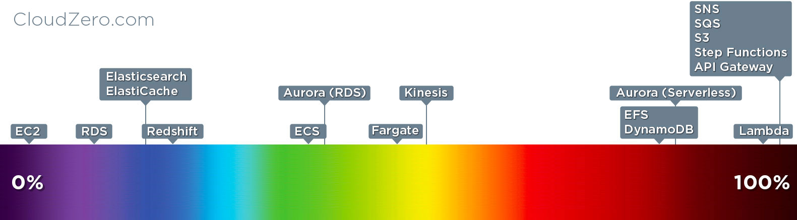
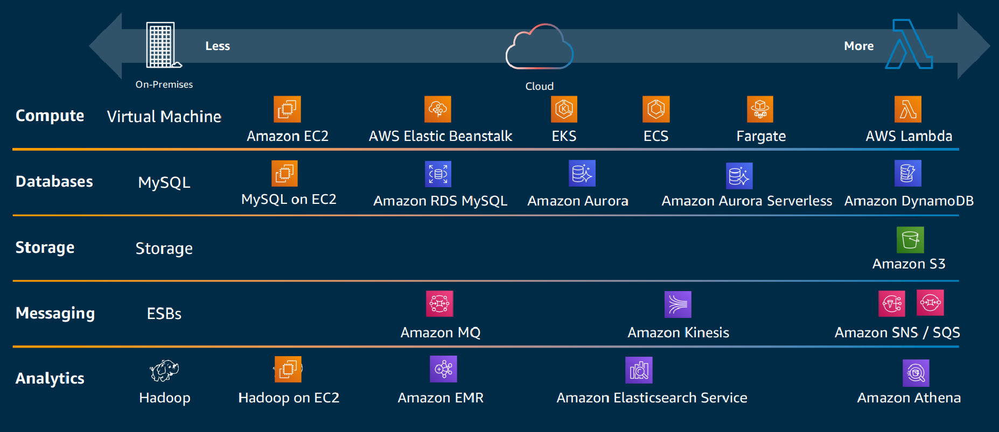
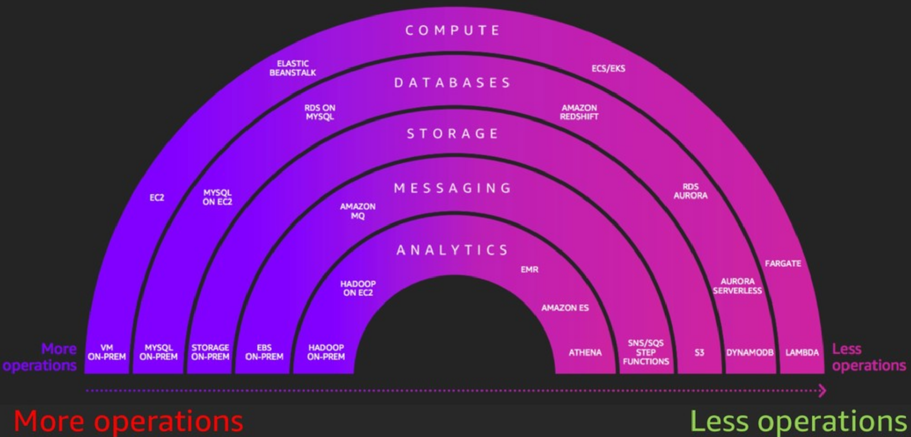
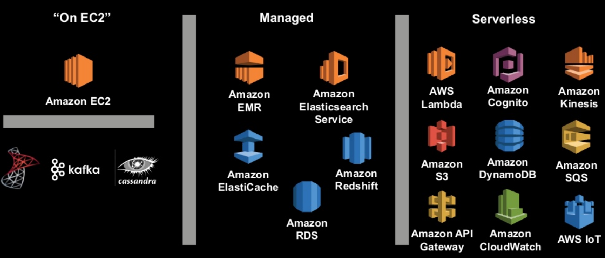
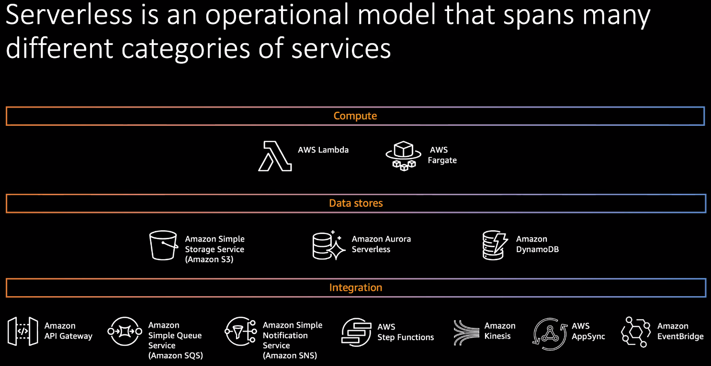

  

 

These are some CDK patterns picked from [AWS Serverless architecture patterns built with CDK](https://github.com/cdk-patterns/serverless) maintained by [@nideveloper](https://twitter.com/nideveloper), read about [his motivation](https://www.mattcoulter.com/blog/post/2) to do that brilliant repo!!

### More resources
* Search into the patterns on [cdkpatterns.com](https://cdkpatterns.com)
* [Blog serie](https://dev.to/nideveloper/what-is-cdkpatterns-com-3lff) going through the patterns.
* [YouTube channel](https://www.youtube.com/channel/UCuR3jnWEnxx1G2axUMVaogg) with some walk throughs of the patterns.
* Social networks: Follow [@CdkPatterns twitter](https://twitter.com/cdkpatterns) for updates. He also writes on dev.to as [nideveloper](https://dev.to/nideveloper) and [cdkpatterns](https://dev.to/cdkpatterns) 
* [Blog post](https://dev.to/nideveloper/cdk-patterns-at-20-let-s-walk-through-all-20-serverless-patterns-for-aws-d1n1) with a walk through when he reached 20 patterns.

### Serverless spectrum

With all the AWS offerings it's useful know where they stand

  

 

  

 

  

 

  

 

  

 

