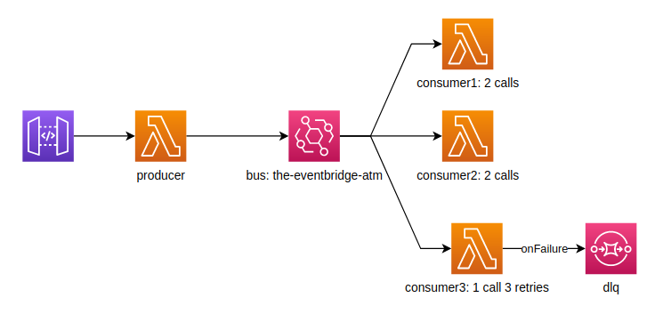
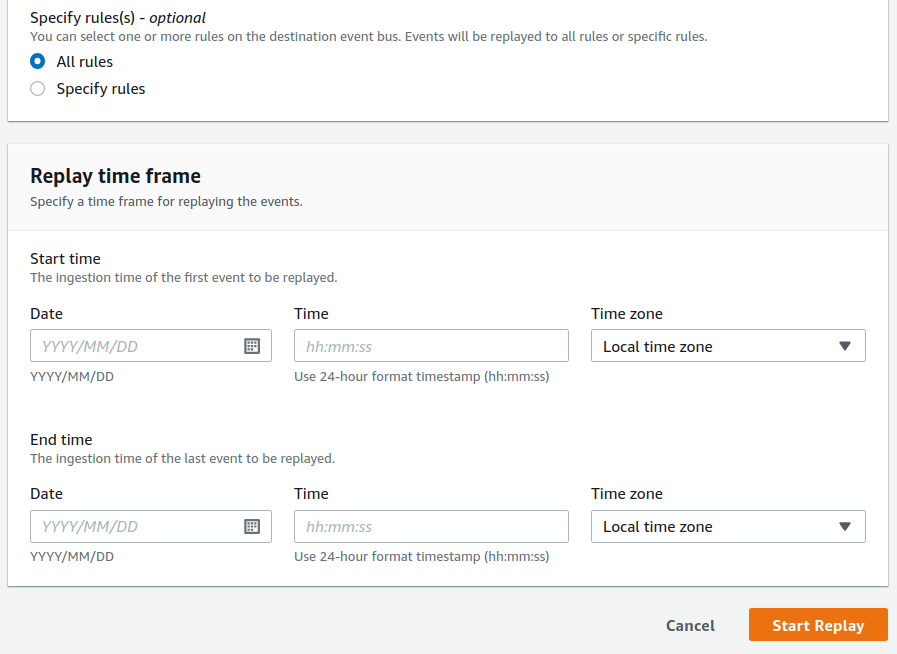

## UPDATE:

>In this repo I made some changes to the original one, it may be convenient taking
a look at the [original readme](#original-readme-the-eventbridge-atm) first and then coming back here.

### Walkthrough

#### Producer
Events sent from lambda producer
```typescript
EventBridge.putEvents({ Entries: [
    {
      // Event envelope fields
      Source: 'custom.myATMapp',
      EventBusName: 'the-eventbridge-atm',
      DetailType: 'transaction',
      Time: new Date(),

      // Main event body
      Detail: JSON.stringify({
        result: 'approved',
        location: 'MA-BOS-01',
      })
    },
    {
      // Event envelope fields
      Source: 'custom.myATMapp',
      EventBusName: 'the-eventbridge-atm',
      DetailType: 'transaction',
      Time: new Date(),

      // Main event body
      Detail: JSON.stringify({
        result: 'approved',
        location: 'NY-NYC-001',
      })
    },
    {
      // Event envelope fields
      Source: 'custom.myATMapp',
      EventBusName: 'the-eventbridge-atm',
      DetailType: 'transaction',
      Time: new Date(),

      // Main event body
      Detail: JSON.stringify({
        result: 'denied',
        location: 'NY-NYC-002',
      })
    }
  ]})
```
EventBridge answers with:
```json5
{
  FailedEntryCount: 0,
  Entries: [
    { EventId: '17ae5bcb-3e1a-2da4-a17d-ac77f9f02d3d' },
    { EventId: '63189a91-b546-99c3-3d8d-0fc4bc7d3e5c' },
    { EventId: '61f0e54e-249a-2b68-0417-e4f8a6084074' }
  ]
}

```

#### Lambda consumer 1
Because of this rule @the-eventbridga-atm-stack.ts:
```typescript
events.Rule(this, 'atmConsumer1LambdaRule', {
  eventPattern: {
    source: ['custom.myATMapp'],
    detailType: ['transaction'],
    detail: {
      result: ["approved"]
    }
  }
})
```
We receive one invocation with this event:
```json5
{
  "id": "17ae5bcb-3e1a-2da4-a17d-ac77f9f02d3d",
  "detail-type": "transaction",
  "source": "custom.myATMapp",
  "time": "2021-03-11T02:19:52Z",
  "detail": {
    "result": "approved",
    "location": "MA-BOS-01",
  }
}

```
...and another invocation with:
```json5
{
  "id": "63189a91-b546-99c3-3d8d-0fc4bc7d3e5c",
  "detail-type": "transaction",
  "source": "custom.myATMapp",
  "time": "2021-03-11T02:19:52Z",
  "detail": {
    "result": "approved",
    "location": "NY-NYC-001",
  }
}
```

#### Lambda consumer 2
Rule @the-eventbridge-atm-stack.ts
```typescript
events.Rule(this, 'atmConsumer2LambdaRule', {
  eventPattern: {
    source: ['custom.myATMapp'],
    detailType: ['transaction'],
    detail: {
      location: [{
        "prefix": "NY-"
      }]
    }
  }
})
```
Events received in lambda
```json5
{
  "id": "61f0e54e-249a-2b68-0417-e4f8a6084074",
  "detail-type": "transaction",
  "source": "custom.myATMapp",
  "time": "2021-03-11T02:19:52Z",
  "detail": {
    "result": "denied",
    "location": "NY-NYC-002",
  }
}
```
```json5
{
  "id": "63189a91-b546-99c3-3d8d-0fc4bc7d3e5c",
  "detail-type": "transaction",
  "source": "custom.myATMapp",
  "time": "2021-03-11T02:19:52Z",
  "detail": {
    "result": "approved",
    "location": "NY-NYC-001",
  }
}
```

#### Lambda consumer 3
Rule @the-eventbridge-atm-stack.ts
```typescript
events.Rule(this, 'atmConsumer3LambdaRule', {
  eventPattern: {
    source: ['custom.myATMapp'],
    detailType: ['transaction'],
    detail: {
      result: [{
        "anything-but": "approved"
      }]
    }
  }
})
```
Event received in lambda:
```json5
{
  "id": "61f0e54e-249a-2b68-0417-e4f8a6084074",
  "detail-type": "transaction",
  "source": "custom.myATMapp",
  "time": "2021-03-11T02:19:52Z",
  "detail": {
    "result": "denied",
    "location": "NY-NYC-002",
  }
}
```
<br />

> Check this documentation about the possibilities when making rules using [content-based filtering](https://docs.aws.amazon.com/eventbridge/latest/userguide/content-filtering-with-event-patterns.html)

In this modified version I forced consumer 3 to error. Also configured its `onFailure` destination to go into a dead letter queue, doing this way, instead of configuring the dlq for the lambda directly (without using `onFailure` destination), the message in the dlq will not only have the event (`requestPayload`) that produced the lambda to error but also the `requestContext`, including for example the `approximateInvokeCount` before failing, and `responsePayload` including the `errorMessage` and stack trace.

<p align="center">
  
</p><br />

This is how the failure received by the dlq looks like:

```json5
{
  "timestamp": "...",
  "requestContext": {
    "requestId": "...",
    "condition": "RetriesExhausted",
    "approximateInvokeCount": 3
  },
  "requestPayload": {
    "id": "...",
    "detail-type": "transaction",
    "source": "custom.myATMapp",
    "time": "...",
    "detail": {
      "result": "denied",
      "location": "NY-NYC-002",
    }
  },
  "responseContext": {
    "statusCode": 200,
    "executedVersion": "$LATEST",
    "functionError": "Unhandled"
  },
  "responsePayload": {
    "errorType": "Error",
    "errorMessage": "Error threw!",
    "trace": [
      "Error: Error threw!",
      "    at exports.case3Handler (/var/task/handler.js:16:9)"
    ]
  }
}
```

Another modification was saving the events on an archive, which allow us to reply the events<br /><br /> 

<p align="center">
  
</p>

## ORIGINAL README: The EventBridge ATM

This is an example CDK stack to deploy the code from this blogpost by [James Beswick](https://twitter.com/jbesw)- https://aws.amazon.com/blogs/compute/integrating-amazon-eventbridge-into-your-serverless-applications/

In this example, a banking application for automated teller machine (ATM) produces events about transactions. It sends the events to EventBridge, which then uses rules defined by the application to route accordingly. There are three downstream services consuming a subset of these events.


## When You Would Use This Pattern

EventBridge is an awesome centralised service for routing events between various consumers based on rules. You could set up an EventBridge within your domain and then accessing events within that domain is as easy as a rule in EventBridge, this significantly cuts down on the number of coupled interactions you have between your various services.

## How to test pattern

After deployment you will have an api gateway where hitting any endpoint triggers the events to be sent to EventBridge defined in lambdas/atmProducer/events.js

* All Approved transactions go to consumer 1
* NY Transactions go to consumer 2
* Declined transactions go to consumer 3

## Useful commands

* `npx cdkp init the-eventbridge-atm` installs this pattern
* `npm run cdk -- destroy -f` destroy pattern without asking
* `npm run build`   compile typescript to js
* `npm run watch`   watch for changes and compile
* `npm run test`    perform the jest unit tests
* `npm run deploy`      deploy this stack to your default AWS account/region
* `cdk diff`        compare deployed stack with current state
* `cdk synth`       emits the synthesized CloudFormation template
