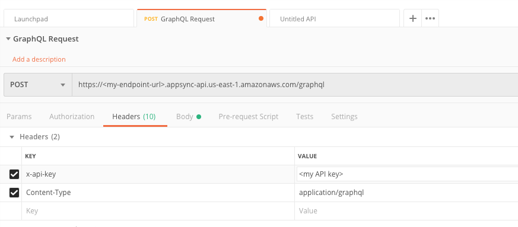

# The Simple GraphQL Service


This is an example CDK stack to deploy The Simple [GraphQL](https://graphql.org/) Service inspired by [Thorsten Hoeger](https://twitter.com/hoegertn)'s contributions to the [CDK AppSync Module example]( https://docs.aws.amazon.com/cdk/api/latest/docs/aws-appsync-readme.html#usage-example)

An advanced version of this pattern was talked about by [Heitor Lessa](https://twitter.com/heitor_lessa) at re:Invent 2019 as "The Cherry Pick".

* [Youtube Recording](https://www.youtube.com/watch?v=9IYpGTS7Jy0)
* [Static Slides](https://d1.awsstatic.com/events/reinvent/2019/REPEAT_3_Serverless_architectural_patterns_and_best_practices_ARC307-R3.pdf)

This is the most basic of [AppSync](https://aws.amazon.com/appsync/) implementations and would have to be hardened before production use. e.g. cognito user pools configured

**Note, never print your API Key to the logs in a production system. This was added to make learning AppSync and GraphQL easier. If you want to use this pattern in a production system remove the two cloudformation outputs**

### Testing

1. After CDK Deploy, capture outputs from the log.

```text
TheSimpleGraphqlServiceStack: deploying...
TheSimpleGraphqlServiceStack: creating CloudFormation changeset...

   TheSimpleGraphqlServiceStack

Outputs:
TheSimpleGraphqlServiceStack.APIKey = <API Key>
TheSimpleGraphqlServiceStack.Endpoint = https://<endpoint URL>.appsync-api.us-east-1.amazonaws.com/graphql
```

2. Setup Postman as outlined in Postman's [Using GraphQL Instructions](https://learning.postman.com/docs/postman/sending-api-requests/graphql/)

3. Set POST request URL, x-api-key and Content-Type
* x-api-key = 'your API Key'
* Content-Type = application/graphql



4. Execute Mutations and Queries to exercice resolvers to dynamo and Lambda datasources


```graphql
# Inserts to Dynamo
mutation add {
  addCustomer(customer: { name: "CDKPatterns"}) {
    id
    name
  }
}

# Queries the Dynamo DB
query getCustomers {
  getCustomers{id name}
}

# Executes the Lambda
query getLoyalty {
  getLoyaltyLevel { level }
}
```

You can also query with curl:

```shell script
ENDPOINT=https://<your api id>.appsync-api.us-east-1.amazonaws.com/graphql
API_KEY=<your api key>
QUERY='{"query":"mutation MyMutation {addCustomer(customer: {name: \"John\"}) {id  name}}"'
curl --request POST $ENDPOINT \
--header "Content-Type: application/graphql" \
--header "x-api-key: ${API_KEY}" \
--data-raw $QUERY
 ```
...or replace the last part for shortening query variable:
```shell script
Q="mutation MyMutation {addCustomer(customer: {name: \\\"John\\\"}) {id  name}}"
curl --request POST $ENDPOINT \
--header "Content-Type: application/graphql" \
--header "x-api-key: ${API_KEY}" \
--data-raw '{"query":"'"$Q"'"}'
```


## Useful commands

 * `npx cdkp init the-simple-graphql-service`   installs this pattern
 * `npm run build`   compile typescript to js
 * `npm run watch`   watch for changes and compile
 * `npm run test`    perform the jest unit tests
 * `npm run deploy`  deploy this stack to your default AWS account/region
 * `cdk diff`        compare deployed stack with current state
 * `cdk synth`       emits the synthesized CloudFormation template
