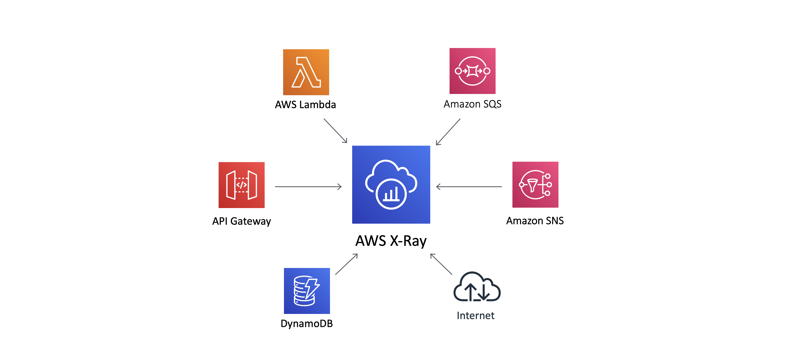
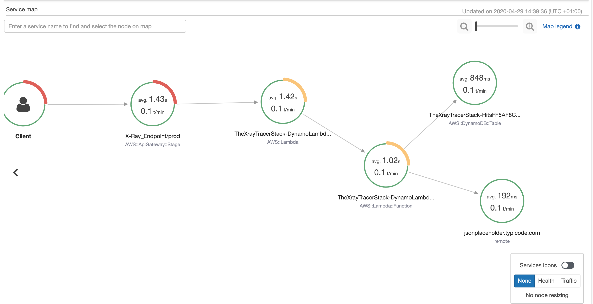
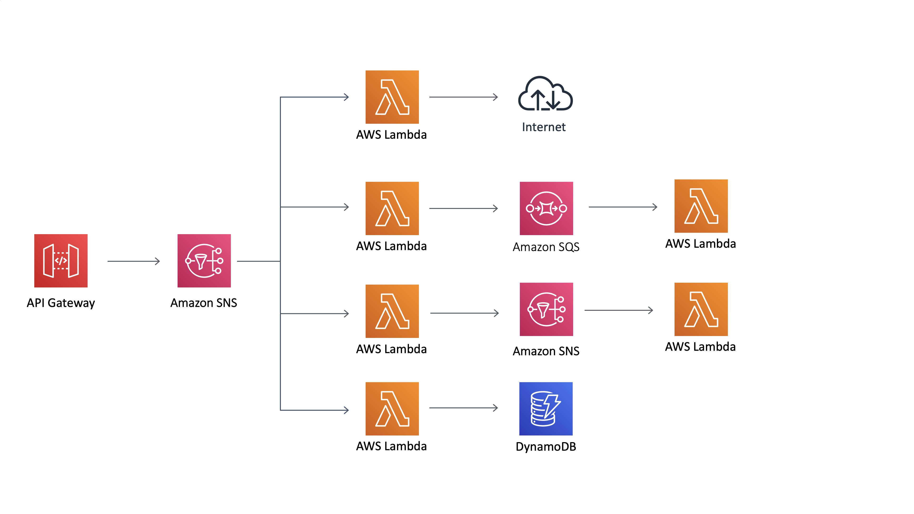
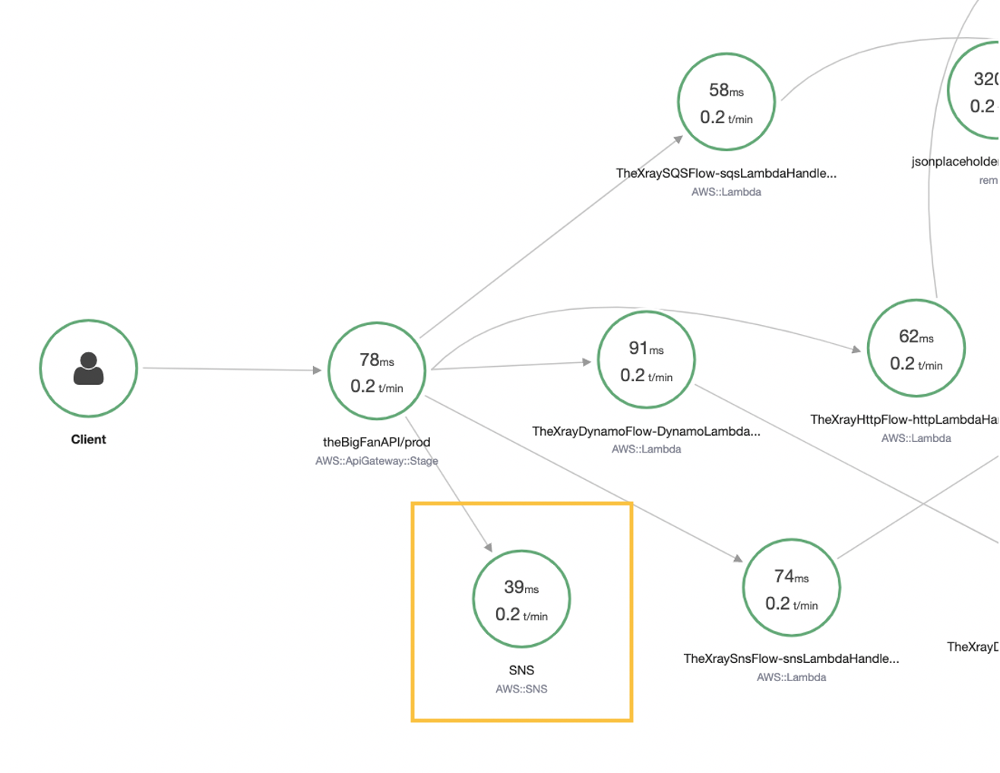
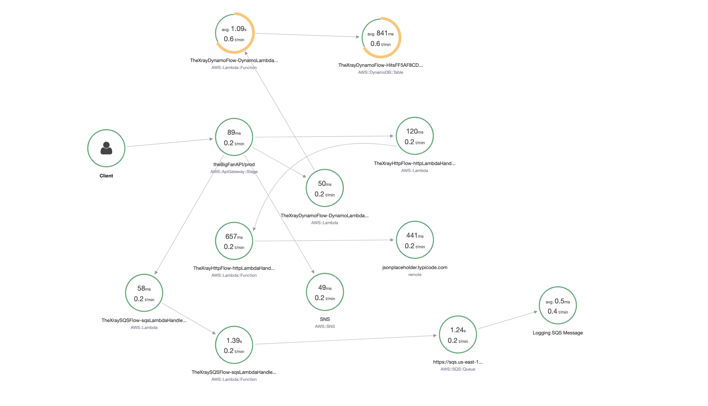

> Check the [original readme](#original-readme-the-x-ray-tracer) first, following is the walkthrough

## Stack TheXrayTracerStack (the-xray-tracer-stack.ts): apigateway ➡️ sns

the-xray-tracer-stack.ts:

```javascript
apigateway.Integration({
  options: {
    requestTemplates: {
      'application/json': "Action=Publish&"+
        "TargetArn=$util.urlEncode('"+snsTopic+"')&"+
        "Message=$util.urlEncode($context.path)&"+
        "Version=2010-03-31"
    }  
  }
})
```

API Gateway logs after GET to `https://<api_id>.execute-api.us-east-1.amazonaws.com/prod/<some_path>`:

```log
HTTP Method: GET, Resource Path: /<some_path>
Method request path: {proxy=<some_path>}
Method request query string: {}
Received response. Status: 200
Endpoint response body before transformations: 
{
    "PublishResponse": {
        "PublishResult": {
            "MessageId": "e4eb0ae2-d586-54e9-b0da-5254dfb34625",
            "SequenceNumber": null
        },
        "ResponseMetadata": {
            "RequestId": "63713948-6f21-5f9f-a15a-61fe6514cd53"
        }
    }
}
Method response body after transformations: 
{
  'message': '{
    PublishResponse: {
      PublishResult:{
        MessageId: "1bad870c-7f52-5778-a755-dfbae0cfef1c",
        SequenceNumber: null
      },
    ResponseMetadata:{
      RequestId: "63713948-6f21-5f9f-a15a-61fe6514cd53"}}}'
}   ---> because of apigateway.Integration({integrationResponses: [{statusCode: "200",responseTemplates: {'application/json': JSON.stringify({ message: '$util.escapeJavaScript($input.body)'... @the-xray-tracer-stack.ts
```

## sns ➡️ lambda

Lambda event:

```log
event {
  Records: [
    {
      EventSource: 'aws:sns',
      EventSubscriptionArn: 'arn:aws:sns:us-east-1:<account>:TheXrayTracerStack-TheXRayTracerSnsFanOutTopicDE7E70F8-ULWUJGACWUO4:c034ad74-207f-484a-ada9-ba31b75b2d09',
      Sns: {
        "Type": "Notification",
        "MessageId": "1bad870c-7f52-5778-a755-dfbae0cfef1c",
        "TopicArn": "arn:aws:sns:us-east-1:<account>:TheXrayTracerStack-TheXRayTracerSnsFanOutTopicDE7E70F8-ULWUJGACWUO4",
        "Message": "/prod/<some_path>",
      }
    }
  ]
}
```

## Stack TheXraySQSFlow (the-sqs-flow-stack.ts): lambda ➡️ sqs

Lambda code (sqs.ts):

```javascript
SQS.sendMessage({
  DelaySeconds: 1,
  MessageBody: "hello from "+ event.Records[0].Sns.Message,
  QueueUrl: process.env.SQS_URL,
}).promise();
```
Response from SQS:

```log
{
  ResponseMetadata: { RequestId: '2144da4a-f54f-5339-8b85-82fc5d869877' },
  MD5OfMessageBody: 'e716e5c1ed8d8e35c31b63e6b20d1e27',
  MessageId: 'c87d5bca-799b-43d6-b1f7-32b6c130d6f8'
}
```

### sqs ➡️ lambda

Lambda event (sqs_subscribe.ts):

```log
event {
  Records: [
    {
      messageId: "c87d5bca-799b-43d6-b1f7-32b6c130d6f8",
      receiptHandle: "AQEBMrPyADApVKuR8No38ZszoGIjEEXW0uxphMQLVALsap9KMEiqGkXyxR4yLmIobDzQerp6KwBGs+hdmu+wiLXjKJIaQvYCP5n5BFi7ev/H619Y9ASEBeUlQEYOPgrKlpnvxu0O9Y9k8UJQz9VHSW4iFltmUwZhIHLA6dSMDBMpXpl1pjNvb3JzKGOvMcfNI5Kc3Al1S+c8UF3sLU+7eKqCE6z6cqekcky8YaqXUOkK3pthw2WHvcWSdON5MgwEFuJAz4EDlWX57Nxy76rb9NLr0VFgCjd+JplJ1VIUKBN8cBOBJbS9YA8+HynDSB9a5yWfqi4iLiggrlmQDG1ey+YMciU8rv+Z1USwaFmJQfviR3pGqLbw/bt4nFNypml//Hg0nfvova8tkuBNN4OWTKKYAldUeouZBL1d7ZuBGonSxy4=",
      body: "hello from /prod/a1",
      attributes: {
        ApproximateReceiveCount: "1",
        AWSTraceHeader: "Root=1-603ca687-5b528b964acfc31d4e6ccd26;Parent=bff4e5bdd37a1813;Sampled=1",
        SenderId: "AROAWY5G2EY6WONRZJUIZ:TheXraySQSFlow-sqsLambdaHandler0DD5DF9B-EXXOIH12XJHL",
      },
      eventSource: "aws:sqs",
      eventSourceARN: "arn:aws:sqs:us-east-1:<account>:TheXraySQSFlow-Queue4A7E3555-BQKL1JR9KOPO",
    }
  ]
}
```

### Stack TheXraySnsFlow: lambda ➡️ sns

Lambda (sns_publish.ts) code:

```javascript
SNS().publish({
  Message: 'Simulated Message',
  TopicArn: process.env.TOPIC_ARN
}).promise();
```

SNS response:

```log
{
  ResponseMetadata: { RequestId: '78e3bd3b-b46b-53a7-b0be-e58d00a12ca3' },
  MessageId: 'c52fca9a-1164-5523-bcdc-922ca5ae2a27'
}
```

## ORIGINAL README: The X-Ray Tracer



This is a pattern not defined by the components used but how they send information back to the AWS X-Ray service to help you make your application perform better when viewed through the Serverless [Well-Architected](https://aws.amazon.com/architecture/well-architected/) lens. A fully well architected solution would use embedded metric format for the logs like in the Julian Wood reference below but I am saving that for another pattern so as not to confuse the concepts.

Some useful references:

| Author        | Link           |
| ------------- | ------------- |
| AWS X-Ray Developer Guide      | [X-Ray Developer Guide](https://docs.amazonaws.cn/en_us/xray/latest/devguide/xray-guide.pdf)  |
| AWS X-Ray Concepts | [X-Ray Concepts](https://docs.aws.amazon.com/xray/latest/devguide/xray-concepts.html) |
| AWS Serverless Lens Whitepaper | [Serverless Lens Whitepaper](https://d1.awsstatic.com/whitepapers/architecture/AWS-Serverless-Applications-Lens.pdf) |
| AWS Well Architected Whitepaper | [Well Architected Whitepaper](http://d0.awsstatic.com/whitepapers/architecture/AWS_Well-Architected_Framework.pdf) |
| [Julian Wood](https://twitter.com/julian_wood) | [Building Well Architected Applications](https://aws.amazon.com/blogs/compute/building-well-architected-serverless-applications-understanding-application-health-part-2/) |
| AWS Developer Blog | [Category: AWS X-Ray](https://aws.amazon.com/blogs/developer/category/developer-tools/aws-x-ray/) |
| AWS Training | [Introduction to AWS X-Ray](https://www.aws.training/Details/Video?id=16450) |

<br />


The [AWS Well-Architected](https://aws.amazon.com/architecture/well-architected/) Framework helps you understand the pros and cons of
decisions you make while building systems on AWS. By using the Framework, you will learn architectural best practices for designing and operating reliable, secure, efficient, and cost-effective systems in the cloud. It provides a way for you to consistently measure your architectures against best practices and identify areas for improvement.

We believe that having well-architected systems greatly increases the likelihood of business success.

[Serverless Lens Whitepaper](https://d1.awsstatic.com/whitepapers/architecture/AWS-Serverless-Applications-Lens.pdf) <br />
[Well Architected Whitepaper](http://d0.awsstatic.com/whitepapers/architecture/AWS_Well-Architected_Framework.pdf)

### The Operational Excellence Pillar

<strong>Note -</strong> The content for this section is a subset of the [Serverless Lens Whitepaper](https://d1.awsstatic.com/whitepapers/architecture/AWS-Serverless-Applications-Lens.pdf) with some minor tweaks.

The [operational excellence pillar](https://d1.awsstatic.com/whitepapers/architecture/AWS-Serverless-Applications-Lens.pdf#page=28) includes the ability to run and monitor systems to deliver business value and to continually improve supporting processes and procedures.

> OPS 1: How do you understand the health of your Serverless application?

#### Distributed Tracing
Similar to non-serverless applications, anomalies can occur at larger scale in distributed systems. Due to the nature of serverless architectures, it’s fundamental to have distributed tracing.

Making changes to your serverless application entails many of the same principles of deployment, change, and release management used in traditional workloads. However, there are subtle changes in how you use existing tools to accomplish these principles.

<strong>Active tracing with AWS X-Ray should be enabled to provide distributed tracing capabilities as well as to enable visual service maps for faster troubleshooting</strong>. 

X-Ray helps you identify performance degradation and quickly understand anomalies, including latency distributions.



Service Maps are helpful to understand integration points that need attention and resiliency practices. For integration calls, retries, backoffs, and possibly circuit breakers are necessary to prevent faults from propagating to downstream services. 

Another example is networking anomalies. You should not rely on default timeouts and retry settings. Instead, tune them to fail fast if a socket read/write timeout happens where the default can be seconds if not minutes in certain clients.

X-Ray also provides two powerful features that can improve the efficiency on identifying anomalies within applications: Annotations and Subsegments.
Subsegments are helpful to understand how application logic is constructed and what external dependencies it has to talk to. Annotations are key-value pairs with string, number, or Boolean values that are automatically indexed by AWS X-Ray.

Combined, they can help you quickly identify performance statistics on specific
operations and business transactions, for example, how long it takes to query a
database, or how long it takes to process pictures with large crowds.


## What is Included In This Pattern?

I wanted to make this pattern as "real" as possible for people so I included most of the serverless components you will use everyday. I have included:

- API Gateway -> SNS -> Lambda (not SQS for reasons [documented later](#sqs---lambda-traces))
- Lambda -> DynamoDB
- Lambda -> SQS -> Lambda
- Lambda -> External Http Endpoint
- Lambda -> SNS -> Lambda

When I map the flow in a high level conceptual image it looks like this:



After deployment, the X-Ray service map looks something like (You get two circles per Lambda):


Or if you look at CloudWatch Service Lens:


You can see that these two diagrams aren't a massive distance away from my high level conceptual flow, the difference is the X-Ray generated diagram is 100% accurate because it is created from real traces based on user flow. When viewed through the AWS Console, it cannot become the out of date diagram you found on a wiki last updated 12 months ago - it is always accurate. If a developer checks in a piece of code that changes the flow, you will see it immediately.

### Project Structure

I separated each of the different SNS subscriber flows above into their own CDK stacks and passed in the SNS Topic ARN as a parameter. Note, in a production system if you want to properly separate these stacks you could use [AWS Systems Manager Parameter Store](https://docs.aws.amazon.com/systems-manager/latest/userguide/systems-manager-parameter-store.html) for the SNS Topic ARN.

if you look inside bin/the-xray-tracer.ts you will see how this works:

```javascript
let xrayStack = new TheXrayTracerStack(app, 'TheXrayTracerStack', {});

let dynamoFlow = new TheDynamoFlowStack(app, 'TheXrayDynamoFlow', {
    snsTopicARN: xrayStack.snsTopicARN
});
let httpFlow = new TheHttpFlowStack(app, 'TheXrayHttpFlow', {
    snsTopicARN: xrayStack.snsTopicARN
});
let sqsFlow = new TheSqsFlowStack(app, 'TheXraySQSFlow', {
    snsTopicARN: xrayStack.snsTopicARN
});
let snsFlow = new TheSnsFlowStack(app, 'TheXraySnsFlow', {
    snsTopicARN: xrayStack.snsTopicARN
});

httpFlow.addDependency(xrayStack, 'need to know the topic arn');
dynamoFlow.addDependency(xrayStack, 'need to know the topic arn');
sqsFlow.addDependency(xrayStack, 'need to know the topic arn');
snsFlow.addDependency(xrayStack, 'need to know the topic arn');
```

All of this logic could have reasonably lived in one stack but this way I can add more technologies later that integrate with X-Ray without increasing the overall complexity of the pattern.

This also means you get 5 vanilla CloudFormation templates bundled:
- xray_tracer_template.yaml
- dynamo_flow_template.yaml
- http_flow_template.yaml
- sns_flow_template.yaml
- sqs_flow_template.yaml

## Testing This Pattern


After you deploy this pattern you will have an API Gateway with the URL being output in the CDK Deploy logs.

Any URL you hit on that gateway will trigger this flow, it uses your URL as the message sent to SNS.

This URL is inserted into DynamoDB with a counter of how many times it was hit, the SNS and the SQS consumer lambdas both log the message to CloudWatch.

To see the random service errors try to hit the URL at least 10 times then you can either navigate to the X-Ray section of the AWS Console followed by clicking on "Service Map" in the sidebar. Please be aware that sometimes there can be a 30 second or so delay before your calls show up in service map.

Alternatively you can go to CloudWatch in the AWS Console and click "Service Lens" in the sidebar. Both offer views onto the system.

## Deliberate Random Errors

I introduced a random SSL Cert error into the Lambda that connects to the External Http Endpoint to let you experiment with using X-Ray to source an error

Service map showing something isn't healthy:<br /><br />


Trace details showing error:
<br /><br />


## Enabling X-Ray
Depending on the component you are using and what it is integrating with you need to enable X-Ray in a different way.

### API Gateway
This is done by simply setting a property of `tracingEnabled: true` on deployOptions:
```javascript
let gateway = new apigw.RestApi(this, 'xrayTracerAPI', {
    deployOptions: {
    metricsEnabled: true,
    loggingLevel: apigw.MethodLoggingLevel.INFO,
    dataTraceEnabled: true,
    tracingEnabled: true,
    stageName: 'prod'
    }
});
```

### Lambda
You set a tracing property to `lambda.Tracing.ACTIVE`
```javascript
this.httpLambda = new lambda.Function(this, 'httpLambdaHandler', {
    runtime: lambda.Runtime.NODEJS_12_X,
    code: lambda.Code.asset('lambdas'),
    handler: 'http.handler',
    tracing: lambda.Tracing.ACTIVE
});
```

### SNS/SQS/DynamoDB
These just pick up when being called from a component with tracing enabled, they do not need a specific setting to enable it. 

### AWS SDK Calls
You need to make sure your AWS SDK code is wrapped with X-Ray during invocation. This is true of any SDK calls e.g. Lambda to Lambda direct invoke, DynamoDB queries, Publishing to SNS etc

```javascript
const AWSXRay = require('aws-xray-sdk');
// Wrap AWS SDK with X-Ray
const AWS = AWSXRay.captureAWS(require('aws-sdk'));

exports.handler = async function(event:any) {

  // Create an SQS service object as normal
  var sqs = new AWS.SQS({apiVersion: '2012-11-05'});
```

### External HTTP Requests

You need to wrap the https module with X-Ray:
```javascript
const AWSXRay = require('aws-xray-sdk');
// Wrap HTTPS module with X-Ray
var https = AWSXRay.captureHTTPs(require('https'));

exports.handler = async function(event:any) {

    // Make a call to a webservice as normal
    const req = https.get("https://url.com", (res:any) => {
```

## Subsegments, Metadata and Annotations

### Subsegments
> A segment can break down the data about the work done into subsegments. [Subsegments](https://docs.aws.amazon.com/xray/latest/devguide/xray-concepts.html#xray-concepts-subsegments) provide more granular timing information and details about downstream calls that your application made to fulfill the original request. A subsegment can contain additional details about a call to an AWS service, an external HTTP API, or an SQL database. You can even define arbitrary subsegments to instrument specific functions or lines of code in your application.

I have included some custom [subsegments](https://docs.aws.amazon.com/xray/latest/devguide/xray-concepts.html#xray-concepts-subsegments) in this pattern, like "external HTTP Request" below:
<br /><br />


These are easy to create inside the Lambda Functions:
```javascript
const subsegment = segment.addNewSubsegment('external HTTP Request');
  
let response = await new Promise((resolve:any, reject:any) => {
    // Make a call to a webservice
    const req = https.get("https://url.com", (res:any) => {
        ... //resolve promise
    });
    ... //reject promise
});

subsegment.addMetadata("response", response)
subsegment.close();
```

### Metadata
You are allowed to put whole objects inside metadata, this is brilliant for showing things like the response from a webservice. 

> Metadata are key-value pairs that can have values of any type, including objects and lists, but are not indexed for use with filter expressions. Use metadata to record additional data that you want stored in the trace but don't need to use with search.

<br />


### Annotations
> Annotations are key-value pairs with string, number, or Boolean values. Annotations are indexed for use with filter expressions. Use annotations to record data that you want to use to group traces in the console, or when calling the GetTraceSummaries API.

<br />


## X-Ray Groups
> X-Ray groups enable customers to slice and dice their X-Ray service graph and focus on certain workflows, applications, or routes.
>
>Customers can create a group by setting a filter expression. All the traces that match the set filter expression will be part of that group. Customers can then view service graphs for the selected group, and understand performance bottlenecks, errors, or faults in services belonging to that service graph.

[Deep dive into AWS X-Ray groups and use cases](https://aws.amazon.com/blogs/developer/deep-dive-into-aws-x-ray-groups-and-use-cases/)

A useful tip is that Annotations can be used in filter expressions so you can easily create groups for smaller bounded contexts within a larger service map and then create CloudWatch alerts per group.

## Known X-Ray "Quirks"

There are a couple of X-Ray quirks that I need to document, I thought it better to show them than refactor the pattern to hide them then you hit one later. If these are a deal breaker for you there are other tools out there for tracing that I have been promised will integrate with no extra code changes like [Epsagon](https://epsagon.com/)

### SQS -> Lambda Traces
There is a [known bug](https://github.com/aws/aws-xray-sdk-node/issues/208) where this doesn't connect and you end up with two paths on your service map.

I have included some logic inside the SQS subscriber lambda to move an X-Ray custom subsegment trace circle from the new second flow to where it should be but this is a workaround and hopefully that bug gets closed sooner than later.

### API Gateway -> SNS through direct integration
X-Ray does work as expected with SNS when using the AWS SDK but for some reason when I do a direct integration with API Gateway through VTL the service map shows the subscribers of the SNS topic as being connected to API GW rather than SNS which is fine because I am not missing information but it's not correct. If I workout a fix for this I will update the pattern.



### Service Map Changes Design Randomly
Unlike other tracing solutions I have used that let you position all of the circles where they give a feeling of inner calmness based on personal OCD; X-Ray randomly positions the circles on every refresh which can lead to some interesting map layouts. The important thing is being able to spot anomalies which you can definitely still do so this is purely aesthetic. 




## Useful commands

 * `npm run build`   compile typescript to js
 * `npm run watch`   watch for changes and compile
 * `npm run test`    perform the jest unit tests
 * `npm run deploy`      deploy this stack to your default AWS account/region
 * `cdk diff`        compare deployed stack with current state
 * `cdk synth`       emits the synthesized CloudFormation template
